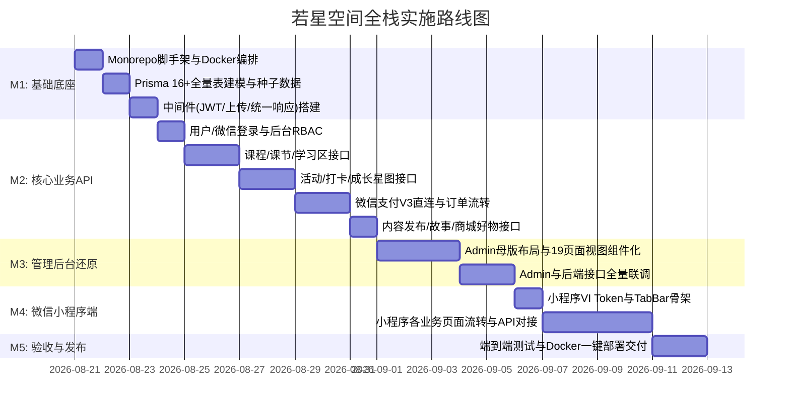

# 若星空间 (Starry Space) - 全栈技术架构与项目开发总纲 (PROJECT_SPEC.md)

> **文档性质**：项目全局技术规范、数据库设计、API 规范与开发流程总纲。  
> **面向对象**：项目负责人、开发工程师、测试工程师及 AI Agent。  
> **版本**：V1.0 ｜ **基准输入**：`docs/PRD/若星小程序PRD.md` (V3.3)、`docs/Design/prototype-v3/`、`docs/Design/VI/`

---

## 目录

- [一、项目与产品定位](#一项目与产品定位)
- [二、项目资产地图（代码与设计在哪里）](#二项目资产地图代码与设计在哪里)
- [三、全栈技术栈选型](#三全栈技术栈选型)
- [四、功能架构与模块划分](#四功能架构与模块划分)
- [五、数据库与数据表结构全景设计 (Prisma)](#五数据库与数据表结构全景设计-prisma)
- [六、API 接口设计与安全规范](#六api-接口设计与安全规范)
- [七、开发守则与核心红线（什么东西不能随便改）](#七开发守则与核心红线什么东西不能随便改)
- [八、测试与验证规范（测试怎么跑）](#八测试与验证规范测试怎么跑)
- [九、DevLog 工程记忆库与任务闭环流](#九devlog-工程记忆库与任务闭环流)
- [十、项目落地实施路线图 (Milestones)](#十项目落地实施路线图-milestones)

---

## 一、项目与产品定位

### 1.1 项目是什么
**若星空间 (Starry Space)** 是若星团队与学员之间的**效能工具与温润陪伴工具**。  
以「课程、活动、内容、会员、商城」为载体，帮助学员有序参与学习与线下实践、沉淀个人成长记录；同时帮助团队高效完成学员管理、报名收款、资料定时发布、内容分发与成长陪伴。

### 1.2 核心边界与原则
- **不是营销裂变工具**：不做诱导分享、不做焦虑营销；
- **不做开放式 UGC 社区**：学员打卡需审核/精选后展示，注重高质量沉淀；
- **不做自有电商闭环**：商城好物推荐一键跳转第三方小程序或外链，不涉及自营实物库存与发货结算；
- **温润美学与极简克制**：视觉风格温润细腻，功能设计克制高效。

---

## 二、项目资产地图（代码与设计在哪里）

```text
starry-mini2/ (Monorepo 根目录)
├── AGENTS.md                  # 【规则】AI Agent 与开发者核心守则
├── README.md                  # 【总览】项目介绍、架构图、本地运行与 Docker 部署指南
├── docker-compose.yml         # 【运维】Postgres + Server + Admin/Nginx 三容器编排
│
├── docs/                      # 【资产与设计输入】权威需求与设计来源
│   ├── PRD/
│   │   └── 若星小程序PRD.md     # 核心需求文档 (V3.3)
│   ├── Design/
│   │   ├── VI/                # 视觉规范与 CSS Tokens (index.html, vi.css)
│   │   └── prototype-v3/      # 交互原型资产
│   │       ├── *.html         # 前台小程序 39 个原型页面
│   │       └── admin/*.html   # 后台管理端 19 个原型页面
│   ├── devlog/                # 【工程记忆库】长期开发日志与决策树
│   │   ├── README.md          # DevLog 索引与阅读指南
│   │   ├── progress.md        # 进度追踪与待办清单
│   │   ├── CHANGELOG.md       # 重要变更日志
│   │   ├── architecture.md    # 架构设计与演进
│   │   ├── decisions.md       # 关键技术决策 (DEC-001 ~ DEC-008)
│   │   ├── issues.md          # 疑难排查记录
│   │   ├── lessons.md         # 踩坑经验与避坑指南
│   │   └── daily/             # 每日/每次开发记录
│   └── PROJECT_SPEC.md        # 本开发设计总纲
│
├── server/                    # 【后端代码】Node.js + Express + TypeScript + Prisma
│   ├── prisma/schema.prisma   # 数据库定义与迁移历史
│   └── src/                   # 控制器、服务、中间件、适配器、工具类
│
├── admin/                     # 【管理后台代码】Vue 3 + Vite + TailwindCSS + TS
│   └── src/                   # 页面、组件、路由、状态管理
│
└── miniprogram/               # 【小程序端代码】微信小程序原生 TS + npm + WXSS
    └── miniprogram/           # 页面、组件、VI 样式、请求封装
```

---

## 三、全栈技术栈选型

| 层次 | 选型 | 核心依据与规范 |
| :--- | :--- | :--- |
| **微信小程序端** | 原生小程序 + TypeScript + npm + WXSS | 官方原生框架，高流畅度，复用 `docs/Design/VI/` 中的 CSS 变量 |
| **管理后台前端** | Vue 3 + Vite + TailwindCSS + Pinia + TS | 像素级复用 `docs/Design/prototype-v3/admin` 原型样式类名 |
| **后端 API 服务** | Node.js (20 LTS) + Express.js + TypeScript | RESTful 分层架构（Routes -> Controllers -> Services -> Prisma） |
| **数据库** | PostgreSQL 16 + Prisma ORM | 强类型数据建模，自动化迁移 (Prisma Migrate) 与 Prisma Studio |
| **文件存储** | 存储适配器模式 (Storage Adapter) | 本地持久化挂载为主，无缝切换腾讯云 COS / 阿里云 OSS |
| **支付交易** | 微信支付 V3 直连 (JSAPI) | 官方 V3 接口、商户私钥签名、AES-256-GCM 验签与事务幂等 |
| **容器部署** | Docker + Docker Compose + Nginx | 标准三容器编排 (`postgres`, `server`, `admin/nginx`) |

---

## 四、功能架构与模块划分

```
                                  ┌────────────────────────────────────────────────────────┐
                                  │               若星空间全栈功能架构体系                 │
                                  └───────────────────────────┬────────────────────────────┘
                                                              │
                    ┌─────────────────────────────────────────┴─────────────────────────────────────────┐
                    ▼                                                                                   ▼
┌───────────────────────────────────────┐                                   ┌───────────────────────────────────────┐
│        前台小程序端 (10 大模块)       │                                   │        管理后台中台 (12 大模块)       │
├───────────────────────────────────────┤                                   ├───────────────────────────────────────┤
│ 1. 用户与个人中心 (登录/资料/地址/订单) │                                   │ 1. 工作台看板 (数据总览/待办聚合)     │
│ 2. 首页 (引言/在学/推荐/故事/好物入口)│                                   │ 2. 课程管理 (课程CRUD/课节编排/名单)  │
│ 3. 课程体系 (筛选/详情/在线报名/支付) │                                   │ 3. 活动管理 (活动CRUD/报名/签到/反馈) │
│ 4. 活动体系 (列表/详情/报名/签到)     │                                   │ 4. 内容发布 (星语/导读/故事/工具表单) │
│ 5. 学习区 (课节解锁/资料下载/学习记录)│                                   │ 5. 故事审核 (学员故事审核/精选上架)   │
│ 6. 打卡实践 (打卡提交/日历墙/海报分享)│                                   │ 6. 打卡管理 (打卡审核/精选/批量导出)  │
│ 7. 内容与故事 (每日星语/导读/工具表单)│                                   │ 7. 标签管理 (按课程/活动配置标签集)   │
│ 8. 会员中心 (层级权益/星图成长线)     │                                   │ 8. 订单管理 (订单明细/退款审批)       │
│ 9. 好物推荐 (分类筛选/跳转第三方)     │                                   │ 9. 商品管理 (好物CRUD/上下架/外链配置)│
│ 10. 全局提醒 (开课前 24h 提醒条)      │                                   │ 10. 页面配置 (首页Banner/报名配置)    │
└───────────────────────────────────────┘                                   │ 11. 学员管理 (学员档案/标签/陪伴记录) │
                                                                            │ 12. 团队与权限 (RBAC 角色/操作日志)   │
                                                                            └───────────────────────────────────────┘
```

---

## 五、数据库与数据表结构全景设计 (Prisma)

数据库采用 **PostgreSQL 16**，通过 `server/prisma/schema.prisma` 全量管理。

### 5.1 用户与权限域（物理隔离）
1. **`User` (小程序学员/会员表)**
   - `id`: String (UUID, PK)
   - `openid`: String (Unique, 微信用户唯一标识)
   - `unionid`: String? (微信开放平台唯一标识)
   - `nickname`: String (昵称)
   - `avatarUrl`: String (头像 URL)
   - `phone`: String? (手机号)
   - `memberTier`: Enum (`FREE`, `BASIC`, `DEEP`, `CO_CREATOR`)
   - `memberExpireAt`: DateTime? (会员过期时间)
   - `points`: Int (星图积分, 默认 0)
   - `status`: Enum (`ACTIVE`, `DISABLED`)
   - `shippingAddress`: Json? (收货地址: 姓名, 手机, 详细地址)
   - `createdAt`, `updatedAt`

2. **`AdminUser` (管理后台成员表)**
   - `id`: String (UUID, PK)
   - `username`: String (Unique, 登录名)
   - `email`: String? (Unique)
   - `passwordHash`: String (Bcrypt 加密密码)
   - `realName`: String (真实姓名)
   - `avatarUrl`: String?
   - `role`: Enum (`SUPER_ADMIN`, `OPERATOR`)
   - `status`: Enum (`ACTIVE`, `DISABLED`)
   - `lastLoginAt`: DateTime?
   - `createdAt`, `updatedAt`

### 5.2 课程与学习区域
3. **`Course` (课程主表)**
   - `id`: String (UUID, PK)
   - `title`: String (课程标题)
   - `subtitle`: String? (副标题/标语)
   - `category`: String (分类: 空间整理 / 深度阅读 / 生活美学 等)
   - `coverUrl`: String (封面图)
   - `price`: Decimal (价格, 单位元)
   - `originalPrice`: Decimal? (原价)
   - `maxStudents`: Int? (人数上限, null 表示不限)
   - `currentStudents`: Int (已报名人数, 默认 0)
   - `enrollStartTime`, `enrollEndTime`: DateTime? (报名起止时间)
   - `courseStartTime`, `courseEndTime`: DateTime? (开课起止时间)
   - `status`: Enum (`DRAFT`, `PUBLISHED`, `OFFLINE`)
   - `description`: Text (课程图文详情/RichText)
   - `formConfig`: Json? (报名表单自定义字段配置)
   - `sortOrder`: Int (排序权重)
   - `isRecommended`: Boolean (是否推荐至首页)
   - `createdAt`, `updatedAt`

4. **`CourseLesson` (课节子表)**
   - `id`: String (UUID, PK)
   - `courseId`: String (FK -> Course.id)
   - `title`: String (课节标题)
   - `sectionName`: String? (所属模块/周次)
   - `sortOrder`: Int (课节序号)
   - `unlockType`: Enum (`IMMEDIATE`, `DAYS_AFTER_START`, `FIXED_TIME`)
   - `unlockDays`: Int? (开课后第几天解锁)
   - `unlockAt`: DateTime? (固定解锁时间)
   - `content`: Text? (课节图文/音视频/引导内容)
   - `materials`: Json? (配套课件/资料附件列表)
   - `createdAt`, `updatedAt`

5. **`CourseEnrollment` (课程报名与学习进度表)**
   - `id`: String (UUID, PK)
   - `userId`: String (FK -> User.id)
   - `courseId`: String (FK -> Course.id)
   - `orderId`: String? (FK -> Order.id)
   - `formData`: Json? (学员报名时提交的表单数据)
   - `shippingStatus`: Enum (`NOT_REQUIRED`, `PENDING`, `SHIPPED`, `DELIVERED`)
   - `shippingTrackingNo`: String? (快递单号)
   - `progressPercent`: Int (学习进度百分比 0-100)
   - `status`: Enum (`ACTIVE`, `COMPLETED`, `REFUNDED`, `CANCELLED`)
   - `enrolledAt`: DateTime (默认当前时间)

### 5.3 活动域
6. **`Activity` (活动主表)**
   - `id`: String (UUID, PK)
   - `title`: String
   - `coverUrl`: String
   - `activityType`: Enum (`ONLINE`, `OFFLINE`)
   - `location`: String? (线下地点或线上会议链接)
   - `price`: Decimal (默认 0.00)
   - `maxParticipants`: Int?
   - `currentParticipants`: Int (默认 0)
   - `startTime`, `endTime`: DateTime
   - `enrollDeadline`: DateTime
   - `status`: Enum (`DRAFT`, `PUBLISHED`, `OFFLINE`)
   - `content`: Text (活动图文介绍)
   - `isRecommended`: Boolean (默认 false)
   - `createdAt`, `updatedAt`

7. **`ActivityEnrollment` (活动报名记录表)**
   - `id`: String (UUID, PK)
   - `userId`: String (FK -> User.id)
   - `activityId`: String (FK -> Activity.id)
   - `orderId`: String? (FK -> Order.id)
   - `isCheckedIn`: Boolean (是否已现场签到)
   - `checkedInAt`: DateTime?
   - `feedback`: Text? (活动后反馈评价)
   - `createdAt`, `updatedAt`

### 5.4 打卡与互动域
8. **`Checkin` (学员实践打卡表)**
   - `id`: String (UUID, PK)
   - `userId`: String (FK -> User.id)
   - `courseId`: String? (关联课程)
   - `lessonId`: String? (关联课节)
   - `content`: Text (打卡文字心得)
   - `images`: Json (图片 URL 数组 `["url1", "url2"]`)
   - `status`: Enum (`PENDING`, `APPROVED`, `REJECTED`)
   - `isFeatured`: Boolean (是否精选上墙)
   - `featuredAt`: DateTime?
   - `adminComment`: Text? (若星团队陪伴寄语/评语)
   - `createdAt`, `updatedAt`

### 5.5 内容与商城域
9. **`Story` (会员故事表)**
   - `id`: String (UUID, PK)
   - `title`: String
   - `authorName`: String
   - `authorAvatar`: String?
   - `summary`: String
   - `content`: Text
   - `coverUrl`: String?
   - `status`: Enum (`DRAFT`, `PUBLISHED`, `OFFLINE`)
   - `isRecommended`: Boolean
   - `createdAt`, `updatedAt`

10. **`DailyContent` (每日星语/内容)**
    - `id`: String (UUID, PK)
    - `date`: String (Unique, 格式 `YYYY-MM-DD`)
    - `quote`: Text (每日金句/引言)
    - `author`: String?
    - `audioUrl`: String? (伴读音频)
    - `content`: Text?
    - `publishedAt`: DateTime
    - `createdAt`, `updatedAt`

11. **`ToolForm` (工具与练习表单)**
    - `id`: String (UUID, PK)
    - `title`: String
    - `category`: String
    - `description`: String?
    - `fileUrl`: String? (模板下载文件)
    - `formSchema`: Json? (在线填写字段配置)
    - `createdAt`, `updatedAt`

12. **`ShopItem` (好物推荐商品表 - 跳转第三方)**
    - `id`: String (UUID, PK)
    - `title`: String
    - `category`: String
    - `coverUrl`: String
    - `images`: Json
    - `price`: Decimal
    - `originalPrice`: Decimal?
    - `thirdPartyAppId`: String? (第三方小程序 AppID)
    - `thirdPartyPath`: String? (第三方小程序跳转页面路径)
    - `thirdPartyUrl`: String? (外部 H5 链接)
    - `status`: Enum (`ON_SALE`, `OFF_SALE`)
    - `sortOrder`: Int
    - `createdAt`, `updatedAt`

### 5.6 交易与订单域
13. **`Order` (统一订单表)**
    - `id`: String (UUID, PK)
    - `orderNo`: String (Unique, 业务订单号如 `SO202608210001`)
    - `userId`: String (FK -> User.id)
    - `orderType`: Enum (`COURSE`, `ACTIVITY`, `MEMBER`)
    - `targetId`: String (关联的具体课程/活动/会员卡 ID)
    - `targetTitle`: String (快照: 商品/课程名称)
    - `amount`: Decimal (实付金额)
    - `status`: Enum (`PENDING`, `PAID`, `REFUNDED`, `CLOSED`)
    - `payTransactionId`: String? (微信支付单号)
    - `paidAt`: DateTime?
    - `refundAmount`: Decimal?
    - `refundReason`: String?
    - `refundAt`: DateTime?
    - `createdAt`, `updatedAt`

### 5.7 标签与配置域
14. **`Tag` (通用标签表)**
    - `id`: String (UUID, PK)
    - `name`: String
    - `group`: String (所属分组: course, student, activity)
    - `color`: String?
    - `createdAt`, `updatedAt`

15. **`StudentTag` (学员-标签多对多关联表)**
    - `id`: String (UUID, PK)
    - `userId`: String (FK -> User.id)
    - `tagId`: String (FK -> Tag.id)

16. **`SystemConfig` (系统全局与首页配置表)**
    - `id`: String (UUID, PK)
    - `key`: String (Unique, 例如 `home_banner`, `home_quote`, `remind_hours`)
    - `value`: Json (配置具体值)
    - `description`: String?
    - `updatedAt`: DateTime

---

## 六、API 接口设计与安全规范

### 6.1 路由结构划分
- **前台学员接口**：`/api/v1/client/*`
  - `/api/v1/client/auth/wechat-login` (微信登录)
  - `/api/v1/client/auth/profile` (获取/更新个人资料)
  - `/api/v1/client/home` (首页聚合数据)
  - `/api/v1/client/courses` (课程列表/详情)
  - `/api/v1/client/courses/:id/enroll` (课程报名下单)
  - `/api/v1/client/study/courses` (我的在学课程)
  - `/api/v1/client/study/lessons/:id` (课节详情与解锁检查)
  - `/api/v1/client/checkins` (打卡提交、我的打卡日历)
  - `/api/v1/client/activities` (活动列表/报名/我的活动)
  - `/api/v1/client/contents/daily` (每日星语)
  - `/api/v1/client/shop/goods` (好物推荐列表)
  - `/api/v1/client/orders` (我的订单列表/详情)
- **后台中台接口**：`/api/v1/admin/*`
  - `/api/v1/admin/auth/login` (管理员登密登录)
  - `/api/v1/admin/dashboard` (工作台统计指标)
  - `/api/v1/admin/courses` (课程与课节 CRUD、报名名单、资料开放)
  - `/api/v1/admin/activities` (活动 CRUD、报名名单、签到核销)
  - `/api/v1/admin/checkins` (打卡审核、精选上墙、批量导出)
  - `/api/v1/admin/stories` (故事发布与审核)
  - `/api/v1/admin/contents` (每日内容、工具表单)
  - `/api/v1/admin/goods` (好物推荐商品管理)
  - `/api/v1/admin/students` (学员档案、标签、陪伴记录)
  - `/api/v1/admin/orders` (订单查询、退款审批)
  - `/api/v1/admin/configs` (首页配置、报名配置)
  - `/api/v1/admin/tags` (标签集管理)
- **通用公共接口**：`/api/v1/public/*`, `/api/v1/payments/wechat/notify` (微信支付回调)

### 6.2 统一响应标准
```typescript
interface ApiResponse<T = any> {
  code: number;       // 0: 成功; 40001: 参数错误; 40101: 未登录; 40301: 无权限; 50001: 服务器异常
  message: string;    // 提示信息
  data?: T;           // 业务数据
  timestamp: number;  // 毫秒时间戳
}
```

---

## 七、开发守则与核心红线（什么东西不能随便改）

1. **红线 1：严禁篡改或删除需求与设计资产**
   - `docs/PRD/` 与 `docs/Design/` 是权威基准，代码实现必须向设计看齐，严禁为了省事随意删减字段或更改交互。
2. **红线 2：严禁直接改动生产数据库表结构**
   - 必须通过修改 `server/prisma/schema.prisma` 并运行 `npx prisma migrate dev` 生成带有时间戳和语义的迁移文件。
3. **红线 3：严禁将敏感凭据硬编码进代码**
   - AppSecret、商户 APIv3 密钥、数据库密码、JWT Secret 必须通过 `.env` 注入。
4. **红线 4：严格保证用户体系物理隔离**
   - 学员 `User` 与管理员 `AdminUser` 分表存储，严禁将微信 openid 逻辑与后台账号权限逻辑混写。
5. **红线 5：微信支付回调必须幂等**
   - 必须使用数据库事务更新订单与报名状态，并校验订单当前状态是否为 `PENDING`。

---

## 八、测试与验证规范（测试怎么跑）

### 8.1 自动化测试体系
1. **后端单元与集成测试 (Jest / Supertest)**：
   ```bash
   cd server
   npm run test          # 运行全部单元测试
   npm run test:e2e      # 运行 API 端到端集成测试
   ```
   - 核心测试覆盖点：微信登录换 Token、Prisma 数据增删改查、鉴权中间件拦截、支付状态机流转。
2. **管理后台编译与类型检查**：
   ```bash
   cd admin
   npm run build         # 执行 TypeScript 类型校验与 Vite 生产构建打包
   ```
3. **小程序端类型编译**：
   ```bash
   cd miniprogram
   npm run build:ts      # 校验 TypeScript 语法与类型对齐
   ```

### 8.2 手动联调与验证流程
1. **本地环境验证**：
   - 启动 PostgreSQL 16；
   - 执行 `npx prisma migrate dev` 与 `npx prisma db seed` 注入种子数据；
   - 启动后端 `npm run dev` (Port 3000)；
   - 启动前端 `npm run dev` (Port 5173)，登录管理后台验证 CRUD 功能；
   - 微信开发者工具打开 `miniprogram/`，验证前台页面渲染与 API 联通。
2. **Docker 一键验证**：
   - 运行 `docker compose up -d --build`；
   - 访问 `http://localhost` 验证 Nginx 反代与 Admin 页面；
   - 访问 `http://localhost/api/health` 验证后端健康状态。

---

## 九、DevLog 工程记忆库与任务闭环流

### 9.1 日志存储位置
所有开发过程记录统一存放于：
```text
docs/devlog/
├── README.md          # 记忆库总入口
├── progress.md        # 进度追踪表
├── CHANGELOG.md       # 重要变更日志
├── architecture.md    # 架构设计与演进
├── decisions.md       # 关键技术决策 (Why)
├── issues.md          # 疑难排查记录
├── lessons.md         # 避坑经验
└── daily/             # 每日开发实录 (YYYY-MM-DD.md)
```

### 9.2 每次完成任务的强制闭环

$$\text{理解需求} \longrightarrow \text{修改代码} \longrightarrow \text{测试验证} \longrightarrow \text{总结反思} \longrightarrow \text{更新 DevLog} \longrightarrow \text{汇报进度}$$

### 9.3 任务完成标准汇报格式
```text
## 开发完成

### 本次完成
- [完成的功能或模块点]

### 主要修改
- `文件路径/函数名`

### DevLog 更新
- `docs/devlog/progress.md`
- `docs/devlog/CHANGELOG.md`
- `docs/devlog/daily/YYYY-MM-DD.md`
- (其他更新的文件)

### 重要技术决策
- [如有决策，注明 DEC-XXX 并指向 decisions.md]

### 遗留问题
- [当前未解决项或注意事项]

### 下一步建议
- [下一步计划实施内容]
```

---

## 十、项目落地实施路线图 (Milestones)



---

*本文档为项目最高技术执行基准，后续任何架构演进须同步更新本文档与 `docs/devlog/`。*
